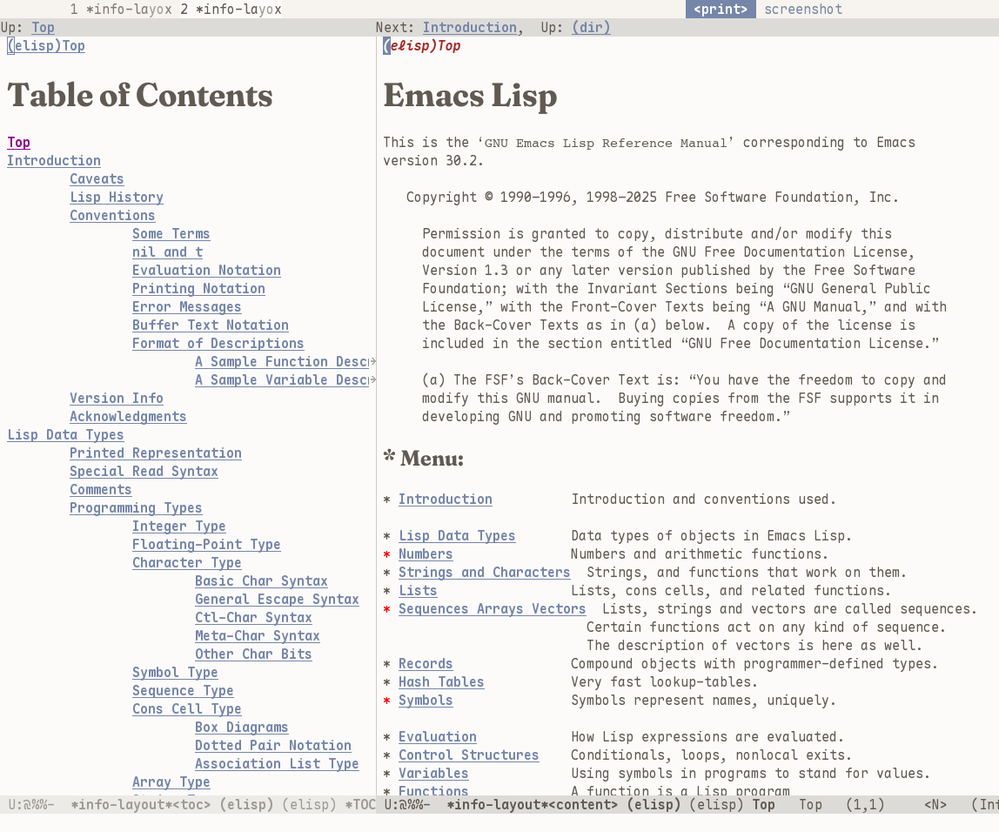

#+title: info-layout
#+startup: indent show2levels
#+filetags: :info:emacs:

* About

- This is an alternative to the [[https://www.gnu.org/software/emacs/manual/html_node/info/Create-Info-buffer.html][info-display-manual]] function (which is usually bound to ~C-h R~).
- This also displays an info manual, but it uses two buffers and two windows to do so.
  + The left window contains the table of contents.
  + The right window contains the contents.
- Actions on the left will drive navigation on the right.

I think this makes info manuals significantly more approachable, especially if one is not familiar with info's keybindings.

* Installation
** MELPA

Soon™

#+begin_src elisp
(use-package info-layout
  :ensure t)
#+end_src

** Git

#+begin_src elisp
(use-package info-layout
  :vc (:url "https://codeberg.org/ggxx/info-layout" :branch "master"))
#+end_src
